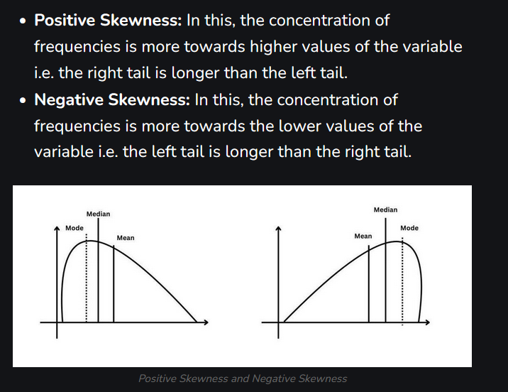
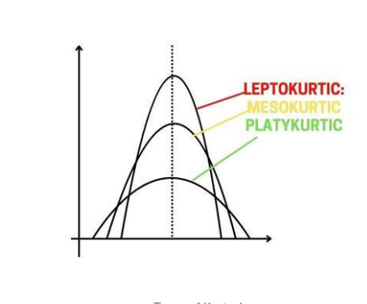

# Embeddings Documentation

## Definition

Embeddings are numerical representations of data, typically in the form of vectors, that capture the semantic meaning of the data. They are commonly used in machine learning and natural language processing to represent words, sentences, or entire documents in a way that algorithms can process.

## Purpose in this project

Our purpose here is to embed a vector that contains Statistical and descriptive information about a time series (specifically, a window of past observations)

## Descriptive Information

The descriptive information we aim to capture includes key statistics, trends, and patterns within the time series data. This may involve aggregating data points, identifying anomalies, and extracting features that are relevant for downstream tasks such as forecasting or classification.

## Stationnarity and Trend Dynamics

To compare windows across decades (e.g., comparing 2023 to 1980), we must remove absolute price levels.

### Simple and Log (Continuous) Returns (Rendement)

* **Definition**: The continuously compounded rate of return from one time step to the next.

* **Interpretation**: This is the "atom" of financial time series. It converts non-stationary price levels into a (mostly) stationary series, allowing the model to compare percentage moves rather than dollar amounts.

* **Why for Retrieval**: Ensures that a 1% drop in the S&P 500 at 4000 points matches a 1% drop at 1000 points.

<!-- $$
R_t = \frac{P_t - P_{t-1}}{P_{t-1}} \quad \text{(Simple Return)}
$$ -->

$$
R_t = \log\left(\frac{P_t}{P_{t-1}}\right) \quad \text{(Log Return)}
$$

### The Hurst Exponent ($H$)

* **Definition**: A measure of the long-term memory of a time series, quantifying the tendency of a series to regress to the mean or cluster in a direction.

* **Interpretation**:
  * $0.5<H<1$: Persistent (Trending). A positive return is likely followed by a positive return.

  * $0<H<0.5$: Anti-persistent (Mean-reverting). A positive return is likely followed by a negative return (choppy/whipsaw markets).

  * $H=0.5$: Random Walk (Brownian Motion). Unpredictable.

* **Why for Retrieval**: You do not want to retrieve a "trending" motif if the current market is in a "mean-reverting" chop. The Hurst exponent forces the retriever to find regimes with similar persistence.

$$
E\left[\frac{R(\tau)}{S(\tau)}\right] = C \cdot \tau^H
$$

Where $R(\tau)$ is the range of cumulative deviations and $S(\tau)$ is the standard deviation.

## Volatility and Risk Clustering

Markets exhibit "volatility clustering"—large changes tend to be followed by large changes. The embedding must capture the energy of the system.

### Realized Volatility (RV)

* **Definition**: The sum of squared returns over a specific window, often annualized.

* **Interpretation**: Represents the magnitude of price movement regardless of direction. High RV indicates panic, news shocks, or liquidity crises. Low RV indicates complacency or consolidation.

* **Why for Retrieval**: Crucial for scaling. We usually retrieve motifs with similar volatility profiles to avoid matching a quiet holiday session with a flash crash.

$$
RV = \sqrt{\frac{252}{N} \sum_{i=1}^{N} R_i^2 }
$$

*(Note: 252 represents annualizing based on trading days).*

### Volatility of Volatility (VoV)

* **Definition**: The standard deviation of the volatility series itself.

* **Interpretation**: Measures the stability of the risk regime. Is the market consistently volatile (high volatility, low vol-of-vol), or is it experiencing sudden, erratic shocks (high vol-of-vol)?

* **Why for Retrieval**: Helps distinguish between "sustained bear markets" (consistent high vol) and "shock events" (sudden spikes).

$$
v = \sqrt{\frac{1}{M-1} \sum_{i=1}^{M} (\sigma_i - \overline{\sigma})^2 }
$$

## Distribution Shape (Tail Risk)

Financial returns are not Normally distributed; they have "fat tails." These moments define the probability of extreme events.

### E. Skewness($S$)

* **Definition**: A measure of the asymmetry of the return distribution.

* **Interpretation**:
  * Negative Skew: Frequent small gains and few extreme losses (typical of equity indices: "stairs up, elevator down").

  * Positive Skew: Frequent small losses and few extreme gains (typical of VIX or lottery-like assets).

* **Why for Retrieval**: Matches the direction of surprise. If the current regime has high negative skew, the retriever should look for historical periods prone to sudden crashes.

$$
S = \frac{E[(r - \mu)^3]}{\sigma^3}
$$

### F. Kurtosis($K$)

* **Definition**: A measure of the "tailedness" of the distribution.

* **Interpretation**: High kurtosis (Leptokurtic) implies that "outlier" events happen much more frequently than a Gaussian model predicts. This is the signature of black swan events or liquidity drying up.

* **Why for Retrieval**: Differentiates "normal" noise from "dangerous" noise. A high-kurtosis regime is fragile.

$$
K = \frac{E[(r - \mu)^4]}{\sigma^4}
$$

*(Excess Kurtosis is often calculated as K−3, since a Normal distribution has K=3).*

## Dependence and Correlation

### Auto-Correlation ($\rho_k$)

$$
\rho_k = \frac{E[(X - \mu_X)(Y - \mu_Y)]}{\sigma_X \sigma_Y}
$$

### Correlation to Benchmarks ($\beta$)

Interpretation:

* $β>1$: High sensitivity (aggressive).
* $β<1$: Low sensitivity (defensive).

Essential for cross-asset retrieval. It allows the system to understand if the asset is currently behaving idiosyncratically (driven by its own news) or systemically (driven by macro factors).

$$
\beta = \frac{Cov(R_{asset}, R_{market})}{Var(R_{market})}
$$

## Statistical Tests
